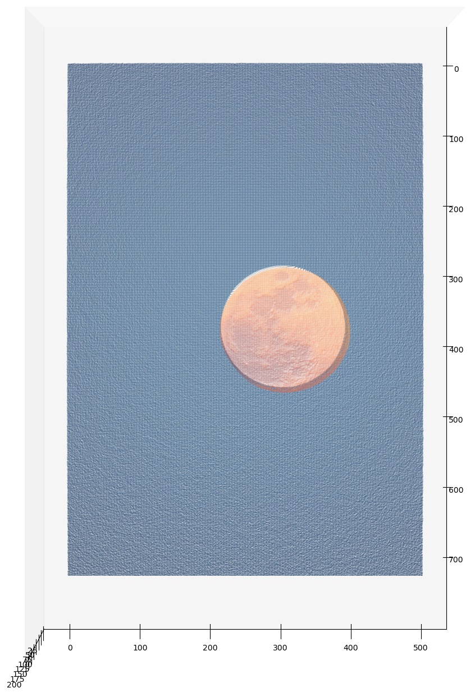
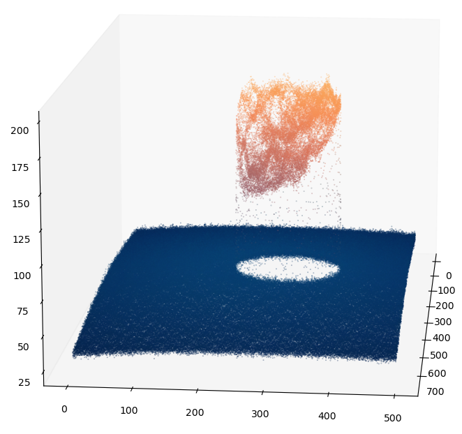
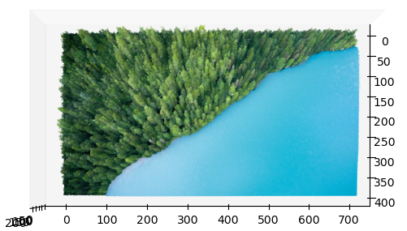
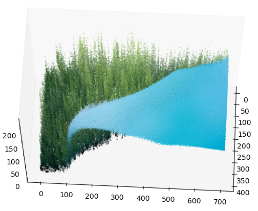
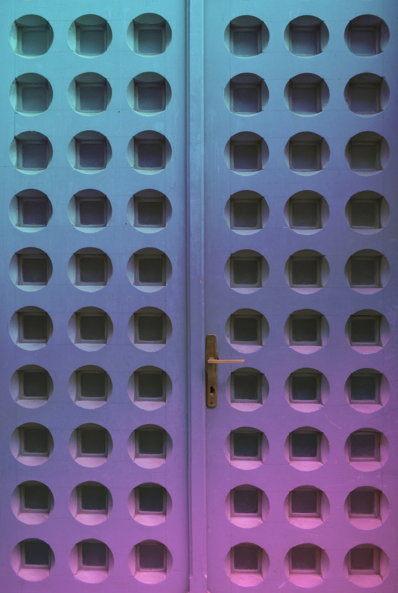
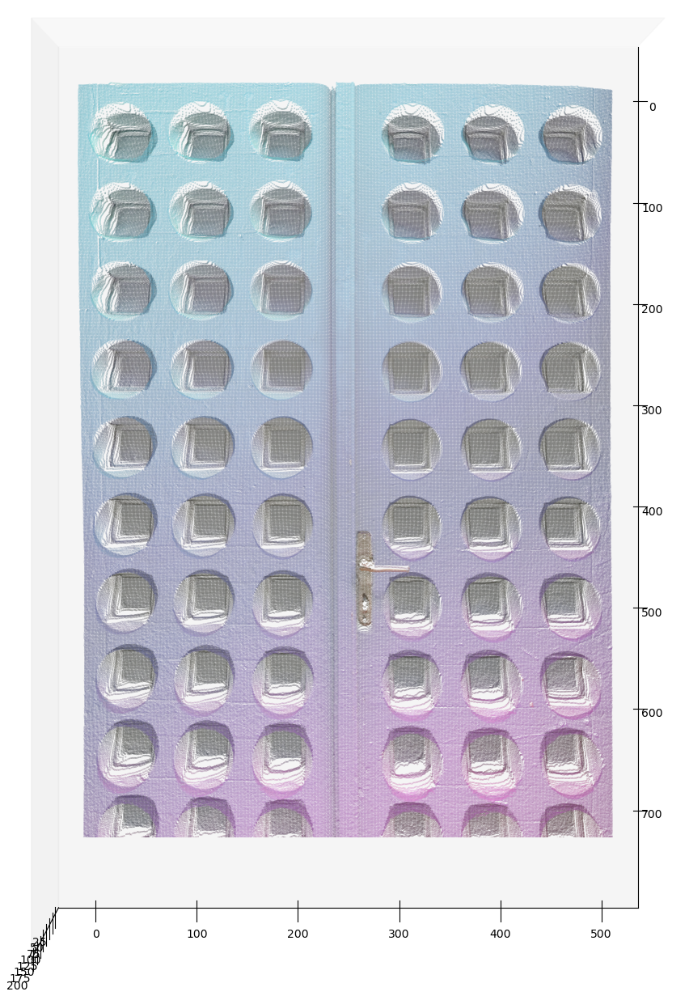
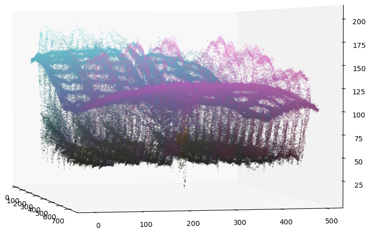
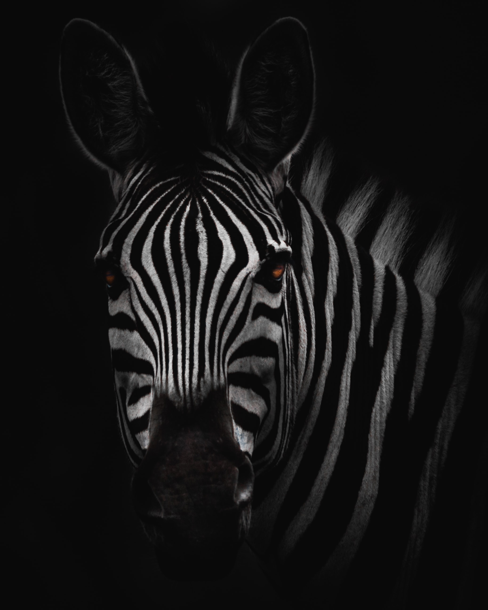
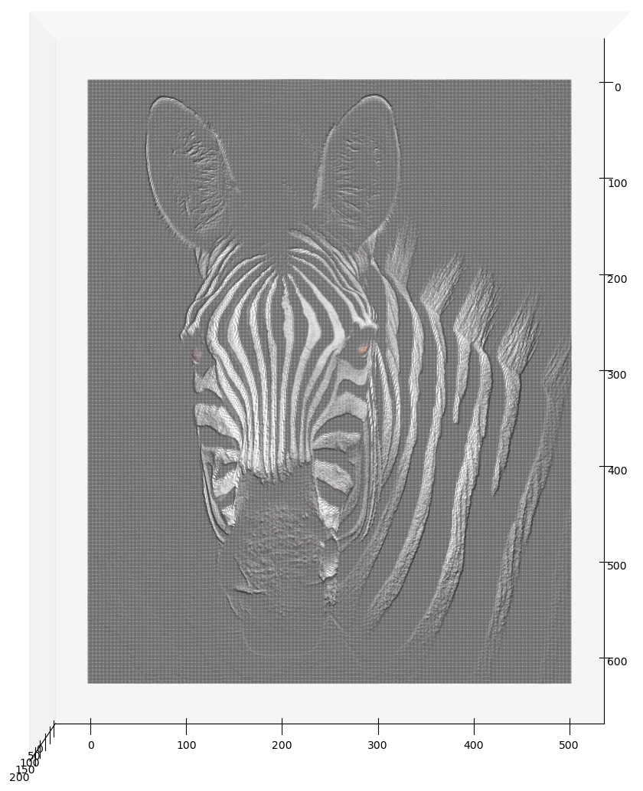
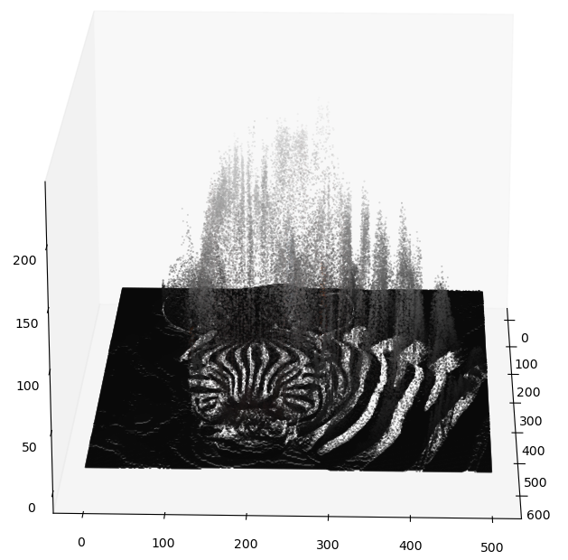

# three_dimensional_image

This python-script takes a rgb-color image as input, which is then visualized within a three dimensional plot.

The gray value of each pixel is interpreted as depth-information. 

## Sample images
Below you find some sample images. Each is displayed as normal input image, top down view onto the 3D image and rotated view onto the 3D image.

### Moon
<table>
<tbody>
  <tr>
    <td width=30%></td>
    <td width=30%></td>
    <td width=30%></td>
  </tr>
  <tr>
    <td colspan="3">
    Photo by <a href="https://unsplash.com/@chuttersnap?utm_source=unsplash&amp;utm_medium=referral&amp;utm_content=creditCopyText">CHUTTERSNAP</a> on <a href="https://unsplash.com/s/photos/moon?utm_source=unsplash&amp;utm_medium=referral&amp;utm_content=creditCopyText">Unsplash</a>
    </td>
  </tr>
</tbody>
</table>

### Forest and Sea
<table>
<tbody>
  <tr>
    <td width=30%></td>
    <td width=30%></td>
    <td width=30%></td>
  </tr>
  <tr>
    <td colspan="3">
    Photo by <a href="https://unsplash.com/@draufsicht?utm_source=unsplash&amp;utm_medium=referral&amp;utm_content=creditCopyText">Andreas Gücklhorn</a> on <a href="https://unsplash.com/s/photos/trees?utm_source=unsplash&amp;utm_medium=referral&amp;utm_content=creditCopyText">Unsplash</a>
    </td>
  </tr>
</tbody>
</table>

### Door
<table>
<tbody>
  <tr>
    <td width=30%></td>
    <td width=30%></td>
    <td width=30%></td>
  </tr>
  <tr>
    <td colspan="3">
    Photo by <a href="https://unsplash.com/@viktortalashuk?utm_source=unsplash&amp;utm_medium=referral&amp;utm_content=creditCopyText">Viktor Talashuk</a> on <a href="https://unsplash.com/s/photos/cheese-holes?utm_source=unsplash&amp;utm_medium=referral&amp;utm_content=creditCopyText">Unsplash</a>
    </td>
  </tr>
</tbody>
</table>

### Zebra
<table>
<tbody>
  <tr>
    <td width=30%></td>
    <td width=30%></td>
    <td width=30%></td>
  </tr>
  <tr>
    <td colspan="3">
    Photo by <a href="https://unsplash.com/@gerandeklerk?utm_source=unsplash&amp;utm_medium=referral&amp;utm_content=creditCopyText">Geran de Klerk</a> on <a href="https://unsplash.com/s/photos/zebra?utm_source=unsplash&amp;utm_medium=referral&amp;utm_content=creditCopyText">Unsplash</a>
    </td>
  </tr>
</tbody>
</table>

## Usage
In case you like to try it on your own images, execute the following steps from your terminal.

1. Clone the repository to your local machine:

        git clone https://github.com/schsmn/three_dimensional_image.git

2. Access the repositories directory by:

        cd three_dimensional_image

3. Setup the conda environment by executing: 

        conda create --name three_dimensional_image_env --file ./requirements.txt 

4. Activate the new environment:

        conda activate three_dimensional_image_env

5. Open the main.py and provide the path to the image as well as the image-name by adapting the corresponding variables.

6. Finaly run the script with:

        python main.py
